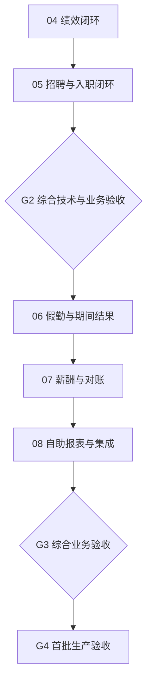

# 后续批次开发规划

不重建既有17组部分实现，不删除48组全量范围。G1限定API技术预验收116项通过，界面/人工/生产仍未通过；不能因此声称整体已完成。当前规划推进后续无依赖工作。

箭头表示当前串行实施和依赖顺序，验收缺少人工确认时先推进其他无依赖子任务，不把所有开发停住。此图不是承诺全量菜单到G4前全部完成。首个生产发布范围需另行明确，其他范围逐批保留。

| 批次 | 可审查业务结果 | 关键依赖 | 不得宣称已完成 |
|---|---|---|---|
| G2 | 同员工绩效目标/变更/结果/申诉；同候选人招聘/录用/原子入职 | 主数据、权限、当前修订、岗位 | 组织绩效全量、渠道/电子签/AI |
| G3-假勤 | 排班/补卡/请假/余额及期间冻结 | 分钟口径、事件版本、冻结定义 | 弹性轮班/设备/自动结转 |
| G3-薪酬 | 编制/独立复核/发布/补差/对账；明确来源 | 冻结考勤契约、金额整数分、企业配置 | 真实税社保/支付/完整自动核算 |
| G3-整合 | 自助可办理与管理报表对齐 | 各领域权威状态和当前权限 | 统一外部集成已上线 |
| G4 | 选定首批范围的业务UAT、容量、云恢复、运维与切换 | 真实验收资料及必要授权 | 私有发布等于生产验收 |

参考已有实现逐包先盘点，再完成组合场景/必要缺口，不为每个模块重复基础平台。工作量保持E1约15%（10%–20%）粗估，未完成逐需求估时前不虚构日程。每次执行30分钟报告实际变化，不能按分支/测试数累计功能进度。

操作入口：Module_Queue.md；各模块文件包含启动提示词、允许路径、前置条件与交还要求。现在启动04；05–08预建并排队，不需要立即开四个新聊天。
