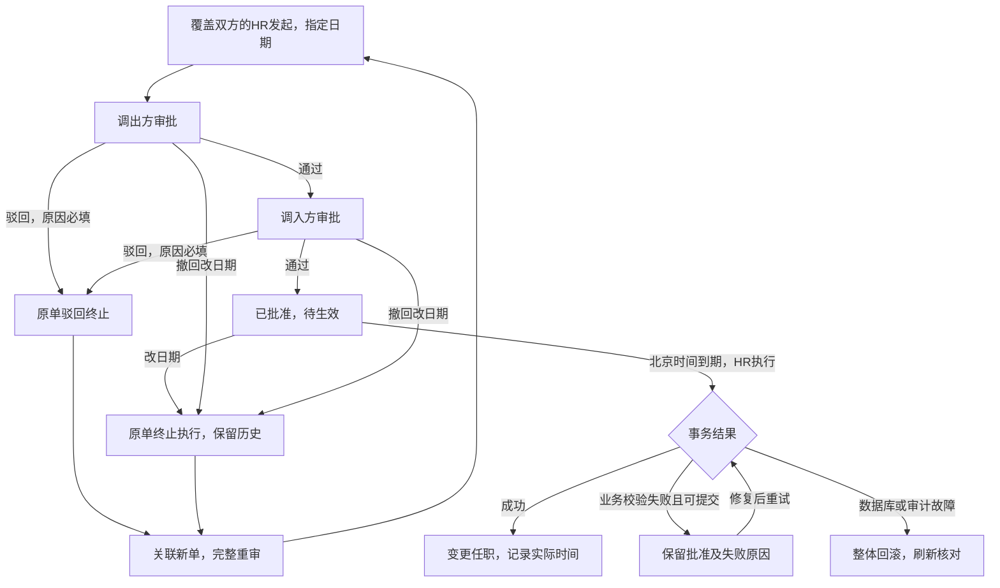
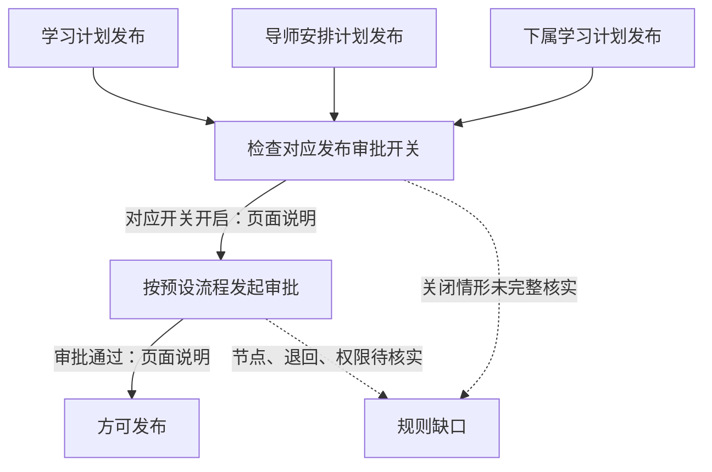
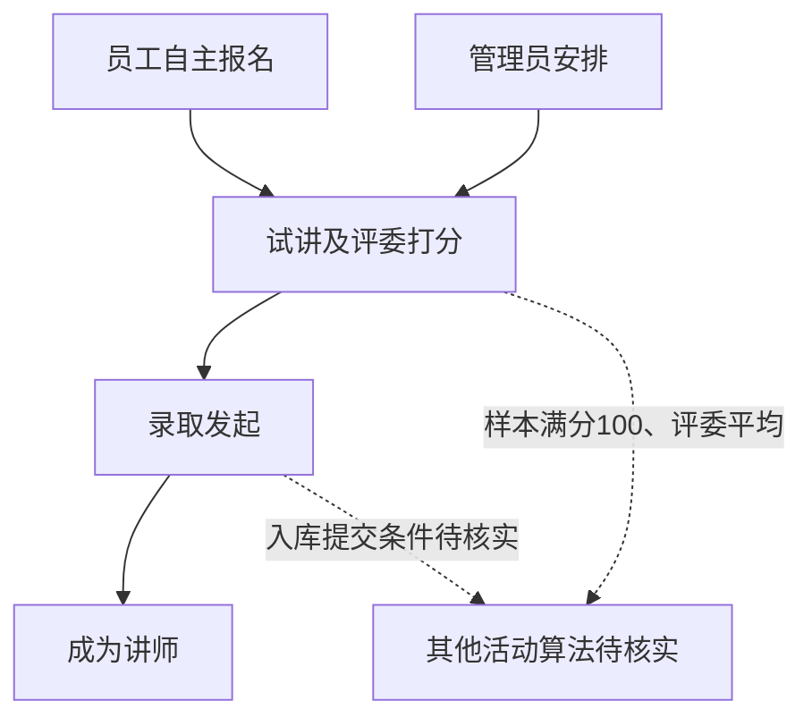
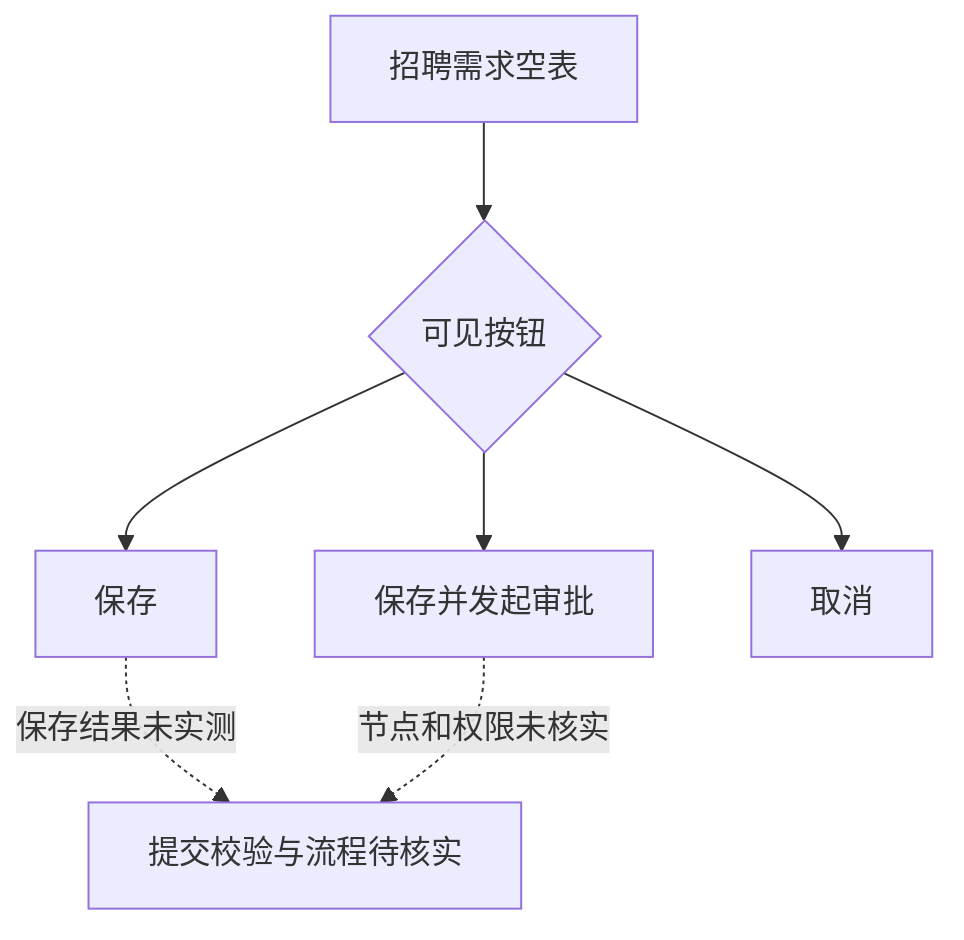
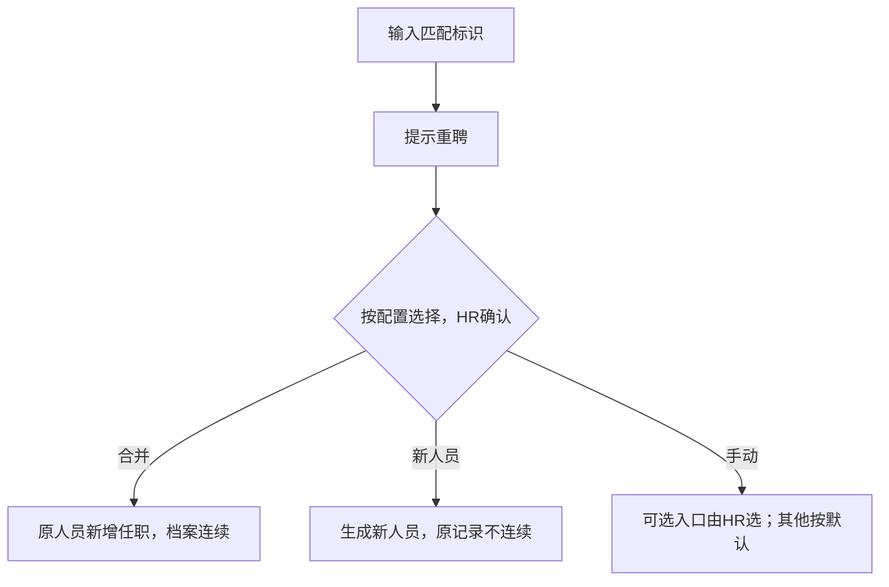
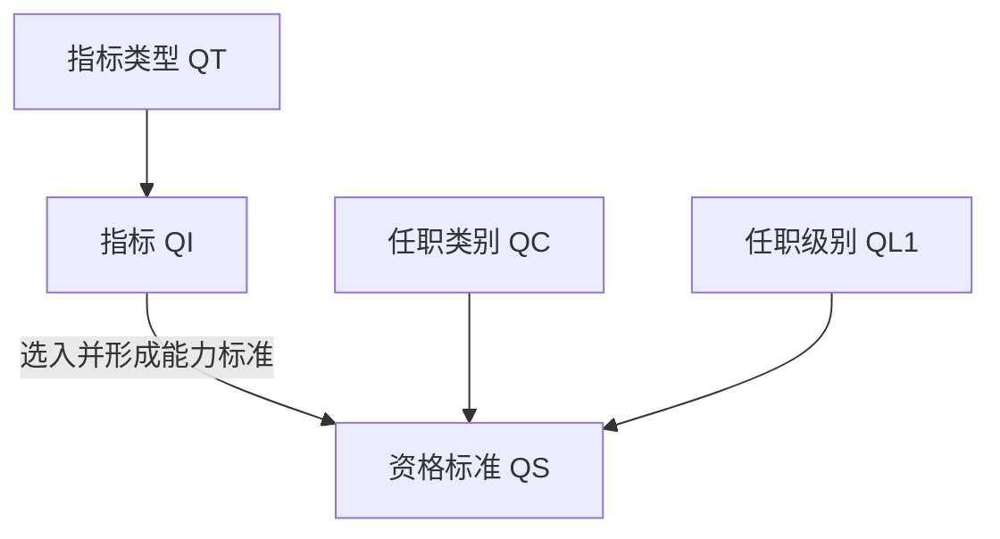

# P1流程图与流程证据边界

生成来源：`Scope_Register.json → deliveryScope / p1Baseline / modules[].p1 / p1B`。本文是同一台账的阅读视图，不独立维护范围或验收状态。更新时间：2026-09-10T03:24:03.609414+00:00。

当前交付为用户确认的15个HR核心模块及六类非模块基础能力；原48组历史完整保留，33组本次交付暂缓，不计完成、不阻当前P1退出。各历史证据的适用时间保持。

实线表示文档明确表达的关系，图标题区分本项目独立设计和原站页面说明；是否执行以各条合成操作记录为准，图本身不证明执行。虚线只指向待核实内容，不用推测补成事实流程。缺少顺序依据时保留步骤表/缺口，不强画状态机。

## P1-F-INDEPENDENT 本项目调动审批与生效

性质：**已确认独立设计**。范围：M01、M19。来源：[F01_F04_Requirements_Baseline.md](../../docs/delivery/F01_F04_Requirements_Baseline.md)，D1–D7。

发起人与异动本人禁自审；两级为不同有效审批者；职级变化须可读；过期未批不能继续通过。结果不明先刷新；实际成功时间不得倒写。 业务失败持久留痕以事务可提交为前提；数据库/审计故障连同尝试记录回滚，F-SPEC-02保留。

边界：用户已决且有实现；原站BC-F03不能证明此状态机。

## P1-C-SOURCE 干部人才流程证据边界

性质：**原站事实/待核实**。范围：M03、M06、M02、M17、M18、M37、M38、M45、M46、M41。来源：[Cadre_Learning_Source_Gaps.md](../../docs/delivery/Cadre_Learning_Source_Gaps.md)，US-C01–03、BC-C01–03；BC-C04–07另见观察文件。

名册→新增空表的页面访问已观察，不据此构造申请→委员会→任命的原站流程。旧干部、干部2.0、任职资格、评定和继任分别保留。

边界：干部四状态与列表仅证明分类，未取得任用/免职转换条件；委员会流程和标准算法待核实。

## P1-L-APPROVAL 学习计划发布审批的三类开关

性质：**原站事实（页面说明）**。范围：M27。来源：[Cadre_Learning_Source_Gaps.md](../../docs/delivery/Cadre_Learning_Source_Gaps.md)，BC-L11。

这是三项独立配置的说明关系，不代表共用一个流程；共享管理员与可学范围不同。

边界：只观察开关及说明；没有切换、提交或验证执行。关闭时完整发布规则、审批节点/退回未知。

## P1-L-CERTIFICATION 师资认证样本页面展示

性质：**原站事实（单活动展示样本）**。范围：M27。来源：[P1_Source_Observations_20260907.md](../../docs/P1_Source_Observations_20260907.md)，师资认证活动详情。

培养培训栏目同时存在，未证明与试讲一律串行，不擅自连入强制前置。

边界：仅一个讲师认证样本，非所有认证的统一规则；没有实操发起录取或入库。

## P1-P-SOURCE 员工绩效模板页面步骤

性质：**原站事实/受限项**。范围：M16。来源：[Performance_Source_Gaps.md](../../docs/delivery/Performance_Source_Gaps.md)，BC-P03–07。

已见页面步骤：基本信息→流程设置→考核表设置→下发指标→权限设置。流程页不说明谁何时审批；算术求和与加权求和均有样本，多维算法未知。

边界：页面步骤不是考核业务流程；既有模板流程页无内容或无权限。

## P1-R-SOURCE 招聘需求空表的分离入口

性质：**原站事实（空表入口）**。范围：M12、M13、M14、M15、M23、M24、M25、M34、M44。来源：[Recruitment_Source_Gaps.md](../../docs/delivery/Recruitment_Source_Gaps.md)，BC-R02/05/08。

职位创建另有职位→广告发布→广告审批三个页面步骤；不能用内部职位草稿代替外发广告。Offer扣占、录用电子签等仍有缺口。

边界：只读按钮与说明；没有保存、发起审批、通知或发布广告。

## P1-A-SOURCE 假勤月报与期间执行

性质：**原站事实/待核实**。范围：M11。来源：[Attendance_Source_Gaps.md](../../docs/delivery/Attendance_Source_Gaps.md)，BC-A03/04/07/08/09。

期间配置有自动冻结/发布/封存开关；说明关闭自动时手动办理；自动任务执行、跨班、结转和企业参数未核实。

边界：冻结、发布、确认、封存各自统计，不能擅自连为强制单线状态机。

## P1-S-SOURCE 发薪活动进度与依赖

性质：**原站事实（活动进度展示）**。范围：M07、M09、M10、M33、M42。来源：[Payroll_Source_Gaps.md](../../docs/delivery/Payroll_Source_Gaps.md)，BC-S01–05。

新建先选择薪资组与方案；未选择真实配置展开依赖。月中调动有两种核算选项，企业采用哪种未知；本项目手工核定/复核/发布不等于原站自动算薪。

边界：数据准备→核算→审核→发放为页面展示进度，非已验证转换/支付结果。

## P1-I-SOURCE 自助、报表与集成边界

性质：**原站事实/待核实**。范围：M04、M05、M08、M19、M20、M21、M22、M26、M28、M29、M30、M31、M32、M35、M36、M39、M40、M43、M47、M48。来源：[Integration_Source_Gaps.md](../../docs/delivery/Integration_Source_Gaps.md)，BC-I01/02/03/04；自助观察；BC-NAV-20260908。

平台/实体筛选已见；字段/方向/调度/重试/权限仍未知。自助复盘仅入口；部门/人员等同名导航不自动共用角色权限。

边界：导航及字段映射筛选不是接口调用/数据同步流程证据；其他N级模块无已验证流程。

## P1-F-REHIRE-SOURCE 重聘识别及方式选择说明

性质：**原站帮助说明事实（未提交验证）**。范围：M01、M12。来源：[P1_Source_Observations_20260907.md](../../docs/P1_Source_Observations_20260907.md)，BC-F15/BC-F25。

帮助明确方式确认后不能更改；图中不画未观察的审批、生效与纠错分支。身份匹配不等于恢复访问。

边界：只读帮助；冲突/撤销/不可手动入口清单未知；不覆盖本项目已批准策略

## P1-P-COEFFICIENT-SOURCE 绩效系数配置与引用路径

性质：**原站示例说明（未执行验证）**。范围：M16。来源：[P1_Source_Observations_20260907.md](../../docs/P1_Source_Observations_20260907.md)，BC-P12–16。

等级模式：等级内设规则→创建活动引用等级→考核生成系数。规则模式：系数规则内配置→绩效模板总览模块绑定→考核按公式生成。总生成方式决定采用哪条路径；规则列表启用状态本身不足以证明使用。

边界：公式/时点/版本变更和薪资消费者未验证；不是本项目已批准系数实现。

## P1-A-MONTHLY-SOURCE 月报处理节点与可配置门槛

性质：**原站配置页面说明，未执行业务**。范围：M11。来源：[P1_Source_Observations_20260907.md](../../docs/P1_Source_Observations_20260907.md)，BC-A11。

配置顺序为冻结、发布、确认、封存；发布前先冻结及在审阻断另有选项，不把它们写成必然约束。自动动作在考勤期间配置，反向操作要求相应节点启用；短周期报表共用处理流程。

边界：未更改选项/执行处理；现有冻结/开放仅独立项目实现，未覆盖发布/确认/审批/封存。

## P1-FLOW-M06-01 M06合成目录到资格标准的已执行关系

性质：**原站合成数据执行结果，仅该链，不是本项目已批准设计**。范围：M06。来源：[P1_Source_Observations_20260907.md](../../docs/P1_Source_Observations_20260907.md)，BC-C19–23；P1OP-C-002/003/005–011。

保存后修改QI说明，QS重开仍原说明；QI引用提示后停用，QS继续启用/可读旧能力标准。级别描述单独补存并回读。上述是不同对象关系，标准保存未要求完成M02活动。

边界：未证明全系统不可变版本或所有状态/权限规则；无人员认证/评定、外部服务或多角色验证。QI当前停用，不能当作仍启用前置。

## P1-FLOW-M03-01 合成干部登记、任期与考察回读

性质：**原站合成执行链；单账号、非项目已批准业务规则**。范围：M01、M03、M19。来源：[P1_Source_Observations_20260907.md](../../docs/P1_Source_Observations_20260907.md)，BC-C25/26、BC-I27；P1OP-C-014/015。

复用M01合成EA/A/JA，登记主职任期与考察，通知否。保存后分别从任免条目回读任期ID/起止，从考察中名单回读考察起止；任期述职按独立AppointmentRecordId打开为空。转正考核草稿带入只读任期/考察信息并另填考核日期，页面有提交审批入口，本次取消。

边界：未提交考核或免职/述职，不画已审批/已转正实线；审批中心类型存在及筛选无行不证明免审批；未来员工离职联动尚未验证。

## P1-FLOW-M17-01 合成人才池成员及阶段和准备度变更

性质：**原站合成执行结果与未执行分支分列**。范围：M17。来源：[P1_Source_Observations_20260907.md](../../docs/P1_Source_Observations_20260907.md)，BC-C27–31；P1OP-C-016–021。

新建仅测试A/不公开/自动入池关的空池，回读PoolId及0成员。人工选EA/新入池/日期9日/显式合成EA指导人，保存唯一成员；另在设置阶段中改培养中并选准备度3~6个月，回读日期与指导人不变。池、成员阶段、准备度、继任关系、IDP流程/模板/计划为分立对象。 BC-C30追溯：页面七字段→P1OP-C-019/020→PoolId+EmployeeInformation成员记录→BP-C-REQ-04及同ID实现对应；下一步依当前队列。0成员是BC-C29建池时历史，最近已确认1成员。

边界：同人指导可存仅是源样本，不代独立审核。继任目标查找未包含测试职位，草稿取消；IDP计划/模板草稿取消，停用流程一次保存结果待核且不重建。阶段变更不证明提名继任、完成IDP或自动入池已验证。

## D1–D7不重新决策

| 决策 | 已确认口径 |
|---|---|
| D1 | 批准与生效分开；北京时间生效日00:00起，由授权HR执行并记实际时间/失败恢复。 |
| D2 | 不得新建过去日期或继续批准过期未批单；改日期终止原单并关联新单完整重审。 |
| D3 | 跨组织发起须覆盖双方；禁止发起人和异动本人自审。 |
| D4 | 调出→调入两级；调入审批人仅见必要摘要。 |
| D5 | 职级变化须在发起和每级办理时可读前后值；权限缺失不能盲审。 |
| D6 | 驳回原因必填，原单终态及关联保留，新单全程重审。 |
| D7 | 本包固定两级不同审批者，不扩会签/分支/委托。 |
